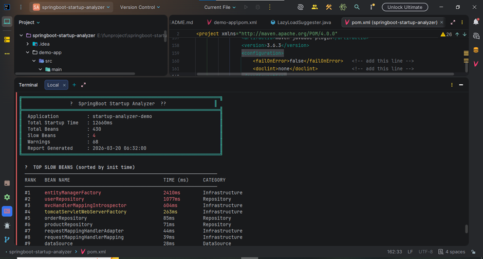
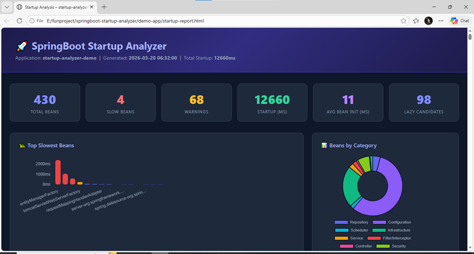

# SpringBoot Startup Analyzer 🚀

[](https://central.sonatype.com/artifact/io.github.anishraj/springboot-startup-analyzer)
[](https://openjdk.org/projects/jdk/17/)
[](https://spring.io/projects/spring-boot)
[](LICENSE)
[](CONTRIBUTING.md)

> **Zero-config Spring Boot library** — add one dependency, get a complete startup analysis: bean timing, blocking call detection, unnecessary autoconfiguration warnings, lazy-load suggestions, and a beautiful HTML dashboard. No annotations. No configuration. Just add and run.

---

## 📸 Screenshots

### Console Output


### HTML Dashboard Report

## 📸 Preview

```
╔══════════════════════════════════════════════════════════════════════╗
║              🚀  SpringBoot Startup Analyzer  🛡️                    ║
╠══════════════════════════════════════════════════════════════════════╣
║  Application        : startup-analyzer-demo                         ║
║  Total Startup Time : 3842ms                                        ║
║  Total Beans        : 147                                           ║
║  Slow Beans         : 6                                             ║
║  Warnings           : 4                                             ║
║  Report Generated   : 2024-11-15 14:23:01                          ║
╚══════════════════════════════════════════════════════════════════════╝

  🐢  TOP SLOW BEANS (sorted by init time)
  ────────────────────────────────────────────────────────────────────
  RANK   BEAN NAME                                 TIME (ms)    CATEGORY
  ────────────────────────────────────────────────────────────────────
  #1     hikariDataSource                          842ms        DataSource
  #2     entityManagerFactory                      634ms        Configuration
  #3     flywayInitializer                         310ms        Infrastructure
  #4     securityFilterChain                       198ms        Security
  #5     dispatcherServlet                         120ms        Infrastructure

  ⚠️   BLOCKING CALL WARNINGS
  ────────────────────────────────────────────────────────────────────
  🗄️ DB Connection     hikariDataSource
                       Consider lazy DataSource initialization...

  💡  LAZY LOAD CANDIDATES
  ────────────────────────────────────────────────────────────────────
  These beans could be annotated with @Lazy to improve startup time:
    → reportingService
    → notificationService
    → auditService
    → scheduledTaskExecutor

  📄  HTML Report saved to: startup-report.html
```

The HTML report is a full interactive dashboard with:
- 📊 Bar chart: Top slowest beans
- 🍩 Doughnut chart: Beans by category  
- 🔍 Searchable table: All beans with timing bars
- ⚠️ Warnings: Blocking calls + unnecessary autoconfigs
- 💡 Lazy-load suggestions

---

## 📦 Installation

### Maven
```xml
<dependency>
    <groupId>io.github.anishraj</groupId>
    <artifactId>springboot-startup-analyzer</artifactId>
    <version>1.0.0</version>
</dependency>
```

### Gradle
```groovy
implementation 'io.github.anishraj:springboot-startup-analyzer:1.0.0'
```

That's it. Run your app — the analyzer activates automatically. ✅

---

## 🚀 Quick Start

```java
// Your existing Spring Boot app — NO changes needed
@SpringBootApplication
public class MyApplication {
    public static void main(String[] args) {
        SpringApplication.run(MyApplication.class, args);
    }
}
```

After startup, you'll see the console summary and find `startup-report.html` in your project root.

---

## ⚙️ Configuration (Optional)

All properties have defaults — **zero config required**. Override only what you need:

```properties
# application.properties

# Master switch (default: true)
startup.analyzer.enabled=true

# Beans slower than this are flagged as "SLOW" (default: 100ms)
startup.analyzer.slow-bean-threshold-ms=100

# HTML report (default: true, saved to startup-report.html)
startup.analyzer.html-report-enabled=true
startup.analyzer.html-report-path=startup-report.html

# Console summary table (default: true)
startup.analyzer.console-report-enabled=true

# Detection features (all default: true)
startup.analyzer.blocking-call-detection-enabled=true
startup.analyzer.lazy-load-suggestions-enabled=true
startup.analyzer.auto-config-analysis-enabled=true

# Minimum bean time to include in report (default: 0 = show all)
startup.analyzer.minimum-bean-time-ms=0
```

---

## 🔍 What It Analyzes

### 1. Bean Initialization Timing
Every Spring bean's initialization time is measured using `BeanPostProcessor` hooks — from `postProcessBeforeInitialization` to `postProcessAfterInitialization`. This captures `@PostConstruct`, `afterPropertiesSet()`, and custom `init-method` execution time.

### 2. Blocking Call Detection
Beans are analyzed using class-name heuristics and timing anomalies to detect:
- **Database connections** — HikariCP, C3P0, DBCP, EntityManagerFactory
- **Outbound HTTP calls** — RestTemplate, FeignClient, WebClient, OkHttp
- **File I/O** — S3Client, BlobStorage, file-reading beans
- **Timing anomalies** — any bean >200ms that doesn't match the above patterns

### 3. Unnecessary AutoConfiguration Detection
Uses Spring Boot's `ConditionEvaluationReport` to identify autoconfiguration classes that loaded but may not be in use — RabbitMQ, Kafka, MongoDB, Quartz, Elasticsearch, etc. Each warning includes the specific exclusion to add to your `@SpringBootApplication`.

### 4. Lazy-Load Suggestions
Identifies peripheral beans (schedulers, reporters, notification services, admin tools) that are not in the critical startup path and could be marked `@Lazy` or enabled via `spring.main.lazy-initialization=true` for faster startup.

### 5. HTML Dashboard Report
A beautiful, self-contained single-file HTML report with Chart.js visualizations — no internet required to view it (charts are loaded from CDN, but all data is embedded).

---

## 🏗️ Architecture

```
                    ┌─────────────────────────────────────────────────┐
                    │         Your Spring Boot Application             │
                    │                                                  │
                    │    @SpringBootApplication                        │
                    │         │                                        │
                    │         ▼  (Spring autoconfigure.imports)       │
                    │    StartupAnalyzerAutoConfiguration              │
                    │         │                                        │
                    │         ├──► BeanTimingPostProcessor             │
                    │         │       (PriorityOrdered.HIGHEST)        │
                    │         │       wraps every bean init            │
                    │         │                                        │
                    │         │    [Application starts normally]       │
                    │         │                                        │
                    │         └──► StartupEventListener               │
                    │               (ApplicationReadyEvent)            │
                    │                    │                             │
                    │         ┌──────────┴──────────┐                 │
                    │         │                     │                 │
                    │    AutoConfigAnalyzer    BlockingCallDetector   │
                    │    LazyLoadSuggester     (heuristics + timing)  │
                    │         │                     │                 │
                    │         └──────────┬──────────┘                 │
                    │                    ▼                             │
                    │           StartupAnalysisReport                 │
                    │                    │                             │
                    │         ┌──────────┴──────────┐                 │
                    │         ▼                     ▼                 │
                    │  ConsoleReportPrinter   HtmlReportGenerator     │
                    │  (ANSI color table)     (Chart.js dashboard)    │
                    └─────────────────────────────────────────────────┘
```

---

## 📁 Project Structure

```
springboot-startup-analyzer/
├── pom.xml                              # Library POM (provided-scope Spring deps)
├── src/main/java/io/github/anishraj/
│   ├── StartupAnalyzerAutoConfiguration.java   # Zero-config entry point
│   ├── agent/
│   │   ├── StartupAnalyzerAgent.java           # Optional Java agent (-javaagent:)
│   │   └── StartupClassFileTransformer.java    # Bytecode transformer (extensible)
│   ├── listener/
│   │   └── StartupEventListener.java           # ApplicationReadyEvent orchestrator
│   ├── processor/
│   │   └── BeanTimingPostProcessor.java        # PriorityOrdered bean timer
│   ├── analyzer/
│   │   ├── AutoConfigAnalyzer.java             # ConditionEvaluationReport analysis
│   │   ├── BlockingCallDetector.java           # Heuristic + timing-based detection
│   │   └── LazyLoadSuggester.java              # Peripheral bean identification
│   ├── model/
│   │   ├── BeanMetric.java
│   │   ├── AutoConfigWarning.java
│   │   ├── BlockingCallWarning.java
│   │   └── StartupAnalysisReport.java          # Central data aggregator
│   ├── report/
│   │   ├── HtmlReportGenerator.java            # Self-contained Chart.js dashboard
│   │   └── ConsoleReportPrinter.java           # ANSI color terminal table
│   └── config/
│       └── AnalyzerProperties.java             # @ConfigurationProperties
├── src/main/resources/
│   └── META-INF/spring/
│       └── org.springframework.boot.autoconfigure.AutoConfiguration.imports
└── demo-app/                                   # Standalone demo Spring Boot app
    ├── pom.xml
    └── src/main/java/io/github/anishraj/demo/
        ├── DemoApplication.java
        ├── model/     User.java, Product.java, Order.java
        ├── repository/ UserRepository, ProductRepository, OrderRepository
        ├── service/   UserService, ProductService, OrderService,
        │              NotificationService, ReportingService, AuditService,
        │              TokenService, InventoryService
        └── config/    AppSecurityConfig, DataInitializer
```

---

## 🛠️ Running the Demo App

```bash
# 1. Build and install the library into your local Maven repo
cd springboot-startup-analyzer
mvn clean install

# 2. Run the demo app
cd demo-app
mvn spring-boot:run
```

After startup completes, open `demo-app/startup-report.html` in any browser.

---

## 🧪 Optional: Java Agent Mode

For even deeper instrumentation (constructor timing, Thread.sleep detection):

```bash
java -javaagent:springboot-startup-analyzer-1.0.0.jar \
     -jar your-app.jar
```

Agent mode is purely additive — it extends the BeanPostProcessor-based analysis.

---

## 🤝 Contributing

Contributions are welcome! Areas to improve:
- ASM-based bytecode instrumentation in `StartupClassFileTransformer`
- Persistent report history (store past N reports)  
- Spring Boot DevTools integration for hot-reload reporting
- Micrometer metrics export for Grafana dashboards

Please open an issue before submitting large PRs.

---

## 📄 License

MIT License — see [LICENSE](LICENSE) for details.

---

<div align="center">
  Built with ❤️ by <a href="https://github.com/anishraj">anishraj</a> &nbsp;|&nbsp;
  <a href="https://github.com/anishraj/springboot-startup-analyzer/issues">Report Bug</a> &nbsp;|&nbsp;
  <a href="https://github.com/anishraj/springboot-startup-analyzer/issues">Request Feature</a>
</div>
